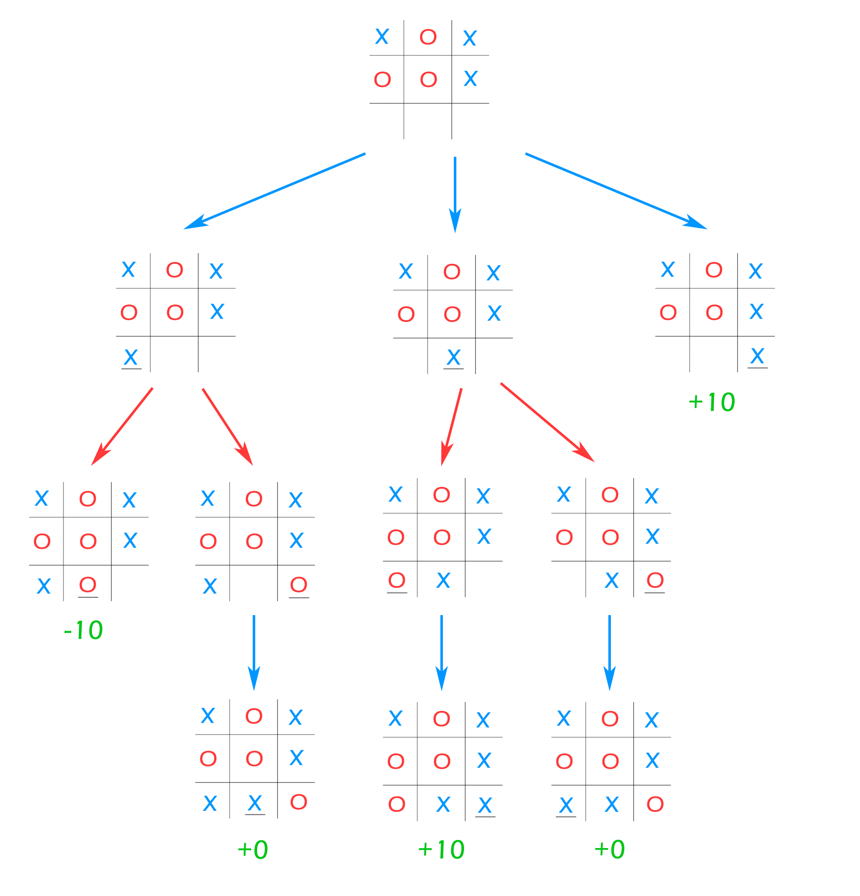

Command to compile Source.cpp

# Quickstart: 
Build the project:
```bash
sudo docker build -t project_cpp .
```

Test the software
```bash
sudo docker run --rm -i project_cpp bash scripts/test.sh
```

Run
```bash
sudo docker run --rm -i project_cpp bash scripts/run.sh
```

# Reproducability in empty container

Empty container with `ubuntu:23.04` requres up-to-date `git`, `cmake` and `g++`. You could install it with

```bash
apt upgrade
apt install git cmake make g++
```

Then you need to run scripts to build dependancies and test software:

```bash
chmod +x scripts/prereqs.sh
./scripts/prereqs.sh

chmod +x scripts/build.sh
./scripts/build.sh

chmod +x scripts/test.sh
./scripts/test.sh
```

And, finally run:

```bash
chmod +x scripts/run.sh
./scripts/run.sh
```

# Tic-Tac-Toe AI

A tic-tac-toe AI program that never loses. This program uses the minimax algorithm with alpha-beta pruning to reduce the search space.

https://en.wikipedia.org/wiki/Minimax#Minimax_algorithm_with_alternate_moves

## Algorithm Details
A **minimax** algorithm is a recursive algorithm for choosing the next move in an n-player game, usually a two-player, back and forth game. A value is associated with each position or state of the game. This value is computed by means of a position evaluation function and it indicates how good it would be for a player to reach that position. The player then makes the move that maximizes the minimum value of the position resulting from the opponent's possible following moves. If it is A's turn to move, A gives a value to each of his legal moves.

A simple version of the minimax algorithm, stated below, deals with games such as tic-tac-toe, where each player can win, lose, or draw. If player A can win in one move, his best move is that winning move. If player B knows that one move will lead to the situation where player A can win in one move, while another move will lead to the situation where player A can, at best, draw, then player B's best move is the one leading to a draw. Late in the game, it's easy to see what the "best" move is. The Minimax algorithm helps find the best move, by working backwards from the end of the game. At each step it assumes that player A is trying to maximize the chances of A winning, while on the next turn player B is trying to minimize the chances of A winning (i.e., to maximize B's own chances of winning).

**Alpha–beta** pruning is a search algorithm that seeks to decrease the number of nodes that are evaluated by the minimax algorithm in its search tree. This allows us to search much faster and even go into deeper levels in the game tree. It cuts off branches in the game tree which need not be searched because there already exists a better move available. The algorithm maintains two values, alpha and beta, which represent the maximum score that the maximizing player is assured of and the minimum score that the minimizing player is assured of respectively. Initially alpha is negative infinity and beta is positive infinity, i.e. both players start with their lowest possible score. It can happen that when choosing a certain branch of a certain node the minimum score that the minimizing player is assured of becomes less than the maximum score that the maximizing player is assured of (beta <= alpha). If this is the case, the parent node should not choose this node, because it will make the score for the parent node worse. Therefore, the other branches of the node do not have to be explored.

## Pseudocode
~~~~
function minimax(node, depth, isMaximizingPlayer, alpha, beta):

    if node is a leaf node :
        return value of the node
    
    if isMaximizingPlayer :
        bestVal = -INFINITY 
        for each child node :
            value = minimax(node, depth+1, false, alpha, beta)
            bestVal = max( bestVal, value) 
            alpha = max( alpha, bestVal)
            if beta <= alpha:
                break
        return bestVal

    else :
        bestVal = +INFINITY 
        for each child node :
            value = minimax(node, depth+1, true, alpha, beta)
            bestVal = min( bestVal, value) 
            beta = min( beta, bestVal)
            if beta <= alpha:
                break
        return bestVal
        
// Calling the function for the first time.
minimax(0, 0, true, -INFINITY, +INFINITY)
~~~~

## Minimax Algorithm Visualisation


# Documentation

